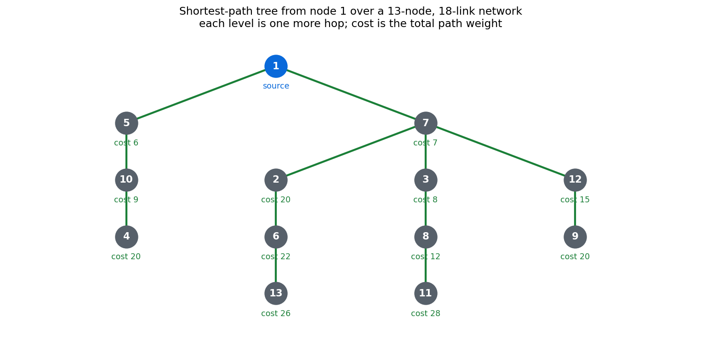

# Routing Protocols

Two shortest-path routing algorithms over the same network, implemented in C++
and driven from an interactive shell: distance vector routing, where each node
knows only its neighbours and learns the rest by exchanging tables, and link
state routing, where every node holds the full topology and runs Dijkstra on it.



The tree above is drawn from the program's own output on the sample topology
below: thirteen nodes, eighteen links, every node reachable, costs rising with
depth.

## Requirements

A C++ compiler and `make`. No third-party libraries.

## Building

```bash
make
```

Produces `routing.out`. Remove the build with `make clean`.

## Usage

```bash
./routing.out
```

Commands are read from standard input:

| command | effect |
| --- | --- |
| `topology a-b-w ...` | Build a graph from edges, each `node-node-weight` |
| `show` | Print the adjacency matrix |
| `dvrp [source]` | Run distance vector routing, optionally from one source |
| `lsrp [source]` | Run link state routing, optionally from one source |
| `remove a-b` | Delete an edge and leave the rest intact |
| `modify a-b-w` | Change the weight of an existing edge |

A session:

```
topology 1-5-6 1-7-7 2-7-13 2-6-2 3-7-1 3-8-4 3-12-8 4-10-11 4-6-19 5-10-3
show
dvrp 1
lsrp 1
remove 4-10
dvrp 1
```

Each run prints the distance and full path from the source to every reachable
node.

## The two protocols

**Distance vector.** Every node keeps a table of its best known distance to each
destination and shares it with its neighbours. A node updates its own table when
a neighbour offers a shorter route, and the process repeats until nothing
changes. No node ever holds the whole graph, which is what makes it cheap to run
and slow to react: news of a broken link spreads only as fast as the tables are
exchanged.

**Link state.** Every node floods its own links to the whole network, so each
one assembles a complete map and computes shortest paths locally with Dijkstra.
Convergence is immediate once the flood completes, at the cost of every node
storing the entire topology.

Both produce identical shortest paths on a static graph, which is the useful
check that the implementations agree. They differ in what each node has to know
and in how they behave when a link changes, which `remove` and `modify` exist to
demonstrate.

## Project structure

```
NetworkTopology.{hpp,cpp}  the graph: edges, weights, adjacency
DVRPProtocol.{hpp,cpp}     distance vector routing
LSRPProtocol.{hpp,cpp}     link state routing
CommandHandler.{hpp,cpp}   parsing and dispatching the shell commands
Constants.hpp              shared limits and formatting
main.cpp                   the read-execute loop
makefile                   build and clean
docs/topology.png          the figure above
```

## Components

| unit | responsibility |
| --- | --- |
| `NetworkTopology` | Stores the graph and answers neighbour and weight queries |
| `DVRPProtocol` | Iterative table exchange until convergence |
| `LSRPProtocol` | Dijkstra over the assembled topology |
| `CommandHandler` | Turns a typed line into an operation on the topology |
